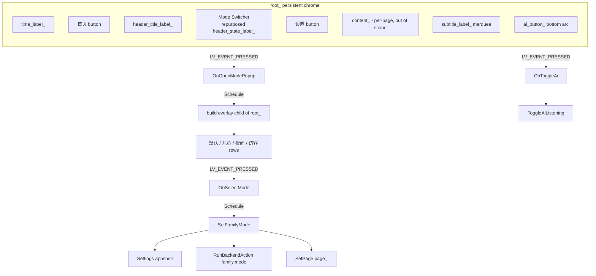

# Design Document

## Overview

This design optimizes the persistent App Shell chrome of the Waveshare ESP32-S3 1.85B firmware
(`main/app_shell/app_shell.cc` / `app_shell.h`) on its 360x360 circular LVGL display. Scope is
strictly the persistent chrome: the top status bar, the bottom status band (marquee), and a new
bottom-arc AI button. Per-page content-region rendering (`RenderHome`, `RenderWeather`, ... , the
`content_` object) is out of scope and is left functionally unchanged.

Three chrome behaviors change:

1. **Mode Switcher (top bar).** The passive backend-status label (`header_state_label_`, fixed text
   "后端") is repurposed into an interactive control that shows the current `family_mode_` and, when
   tapped, opens a modal-ish Mode Popup listing the four family modes (默认 / 儿童 / 夜间 / 访客). Selecting
   a mode applies it and closes the popup.
2. **Offline initial default.** When there is no saved `family_mode` preference and the device is
   offline at initialization time, the initial mode becomes 儿童; otherwise 默认. A saved preference is
   always respected, and later connectivity changes never force a mode switch.
3. **AI button + marquee reposition + backend-status folding.** A persistent, arc-friendly AI button
   is added to the bottom arc. The subtitle/marquee (`subtitle_label_`) moves up a notch to make room,
   keeps its circular-scroll behavior, and gains a backend online/offline token (since the top bar no
   longer shows backend status).

A dedicated `SetFamilyMode(mode)` entry point is introduced so both the new popup selection and the
existing `CycleFamilyMode()` BOOT-cycle path share one persistence / backend-sync / render code path.
The existing kFamilyMode ("模式") detail page stays read-only and out of the BOOT cycle. The navigation
doc (`docs/family-ai-os/03-page-navigation.md`) is updated to match.

### Grounding in the current code

Key facts confirmed by reading the current implementation:

- `EnsureUi()` builds the chrome once: `time_label_`, a 首页 button, `header_title_label_`,
  `header_state_label_` at `(x=30, y=33, width=42)`, a 设置 button, the `content_` container, and
  `subtitle_label_` at `y=kFooterTop(330)`, height 18, width `kFooterWidth(168)`, with
  `LV_LABEL_LONG_SCROLL_CIRCULAR`.
- Header buttons are built with `CreateButton(...)` using `LV_EVENT_PRESSED` and a click-area
  expansion (`ext_click_area`). Handlers are free functions like `OnShowHome(lv_event_t*)` that wrap
  the real action in `Schedule(...)`, which defers to `Application::GetInstance().Schedule(...)`.
- `UpdateHeader()` currently forces `header_state_label_` text to "后端" and colors it by
  `backend_.online`.
- `UpdateSubtitle()` composes `AiStateText()` plus the optional `subtitle_` segment, chooses
  CLIP vs SCROLL based on `TextFitsLabelWidth`, and positions at `kFooterTop`.
- `CycleFamilyMode()` computes the next mode inline, then persists to `Settings("appshell")`, sets
  `subtitle_`, calls `RunBackendAction("family.mode", ...)`, and `SetPage(page_)`.
- Init reads `family_mode_ = settings.GetString("family_mode", "默认")` right after
  `AppConnectivityManager::GetInstance().Refresh()` (so connectivity status is available at that point
  via `AppConnectivityManager::GetInstance().status().online`).
- `OnBackendSnapshot()` already overwrites `family_mode_` from the backend snapshot when the backend
  reports a non-empty `family_mode` — this is the existing backend→device sync and must be respected.
- `RenderOrDefer()` defers rendering when `IsInputPressed()` is true (touch active), setting
  `render_pending_`. `SetPage()`/`SetPageLocked()` render under a `DisplayLockGuard`.
- `ToggleAiListening()` drives `Application` start/stop listening and mirrors the BOOT long-press
  (`Application::ToggleChatState`). The free function `ToggleAiAction()` → `OnToggleAi(lv_event_t*)`
  already exists and wraps it in `Schedule`.

## Architecture

The App Shell is a singleton (`AppShell::GetInstance()`) that owns a single LVGL widget tree rooted at
`root_` (a child of `lv_scr_act()`). All page transitions call `SetPage()` → `SetPageLocked()` →
`EnsureUi()` (idempotent) + `Render()`. `Render()` refreshes chrome (`UpdateClock`, `UpdateHeader`,
`UpdateSubtitle`) and rebuilds `content_`.

This design keeps that architecture and adds:

- Persistent chrome widgets created once in `EnsureUi()`: the Mode Switcher (replacing
  `header_state_label_`) and the AI button (`ai_button_`).
- A transient overlay (the Mode Popup) created on demand as a direct child of `root_` and torn down on
  selection or dismissal. It is not part of `content_`, so `ClearContent()` (which rebuilds page
  content) never touches it.
- Two extracted pure helper functions in the anonymous namespace so the decision logic is unit/
  property testable independent of LVGL and NVS:
  - `ChooseInitialFamilyMode(stored, has_stored, offline_at_init)`
  - `NextFamilyMode(current)`
  - `ComposeFooterText(ai_state_text, subtitle, page_is_ask_ai, backend_online)`



### Deferred-action pattern

All widget event callbacks follow the existing pattern: the `lv_event_cb_t` is a thin free function
that calls `Schedule(action)`. `Schedule` posts the work onto the application task
(`Application::GetInstance().Schedule`), so the heavy work (rebuilding UI, persistence, backend calls)
runs outside the LVGL input/event context. The Mode Popup open, mode selection, and AI toggle all use
this pattern. Because selection triggers `SetFamilyMode` → `SetPage`, and `SetPage` acquires a
`DisplayLockGuard`, callbacks must not already hold the display lock; scheduling on the app task
guarantees this (consistent with `OnShowHome` etc.).

## Components and Interfaces

### 1. Mode Switcher (top bar)

**Widget choice.** Convert `header_state_label_` into a tappable control. To reuse existing styling and
click-area handling, build it with the `CreateButton(...)` helper (which returns a clickable rounded
panel containing a centered label) rather than a bare label wrapped in a clickable object. The member
`header_state_label_` is retained as the *button* handle (its inner label text is updated via the
button's child label). To keep updates simple, a dedicated member is added:

```cpp
lv_obj_t* mode_switch_btn_ = nullptr;    // replaces the passive header_state_label_
```

`header_state_label_` is removed from `EnsureUi`/`UpdateHeader` usage. (The member may be deleted from
the header, or kept unused; this design removes it to avoid dead state — see Data Models.)

**Creation (in `EnsureUi`).** Where the old label was created:

```cpp
mode_switch_btn_ = CreateButton(root_, FamilyModeText(), 30, 27, 60, 30,
                                OnOpenModePopup, false, LV_EVENT_PRESSED, 8);
```

Geometry keeps the switcher inside the top bar band and within the circular safe area (see layout
notes). Width grows slightly (to ~60) to fit two-character mode names comfortably; the existing 首页/设置
buttons remain at x=-80 / x=+80, so a width-60 control centered near x=30 does not overlap them.

**Text update (in `UpdateHeader`).** Replace the forced-"后端" logic with:

```cpp
void AppShell::UpdateHeader() {
    if (header_title_label_) lv_label_set_text(header_title_label_, PageTitle());
    if (mode_switch_btn_) {
        // update the button's inner label to the current mode name
        SetButtonText(mode_switch_btn_, FamilyModeText());
    }
}
```

A small helper `SetButtonText(lv_obj_t* button, const char* text)` retrieves the button's child label
(`lv_obj_get_child(button, 0)`) and sets its text. This satisfies R1.1/R1.2 (shows and updates the
active mode name) and R1.7 (replaces the passive backend-status label).

**Open handler.**

```cpp
void OnOpenModePopup(lv_event_t*) { Schedule(OpenModePopupAction); }
void OpenModePopupAction() { AppShell::GetInstance().OpenModePopup(); }
```

`OpenModePopup()` is a new private method that builds the overlay (below). This satisfies R1.3/R1.4.

### 2. Mode Popup (overlay)

A transient modal-ish overlay listing exactly the four modes (R1.5).

**Structure.** A dark, semi-opaque full-`root_` scrim (`mode_popup_` container) sized to
`display_->width() x display_->height()`, centered, capturing taps outside the panel to dismiss. Inside
it, a centered rounded panel (`CreatePanel`) holds four full-width rows built with `CreateButton` (one
per mode), stacked vertically. The panel and rows are sized to fit within the 360 circular safe area
(panel width ~180, centered; rows ~160 wide, ~34 tall with ~6 gap). Four rows at 34+6 ≈ 160 px total
fit comfortably within the central safe band.

```cpp
lv_obj_t* mode_popup_ = nullptr;   // overlay root; nullptr when closed
```

**Creation (`OpenModePopup`).**

```cpp
void AppShell::OpenModePopup() {
    DisplayLockGuard lock(display_);
    if (mode_popup_ != nullptr) return;               // idempotent
    mode_popup_ = lv_obj_create(root_);
    lv_obj_remove_style_all(mode_popup_);
    lv_obj_set_size(mode_popup_, display_->width(), display_->height());
    lv_obj_align(mode_popup_, LV_ALIGN_CENTER, 0, 0);
    lv_obj_set_style_bg_opa(mode_popup_, LV_OPA_50, 0);
    lv_obj_set_style_bg_color(mode_popup_, lv_color_hex(0x000000), 0);
    lv_obj_add_flag(mode_popup_, LV_OBJ_FLAG_CLICKABLE);
    lv_obj_add_event_cb(mode_popup_, OnDismissModePopup, LV_EVENT_PRESSED, nullptr); // outside tap
    auto panel = CreatePanel(mode_popup_, 0, 0, 180, 190, kPanelBg, kBorder, 20);
    lv_obj_center(panel);
    // rows: 默认 / 儿童 / 夜间 / 访客
    const char* modes[] = {"默认", "儿童", "夜间", "访客"};
    for (int i = 0; i < 4; ++i) {
        auto row = CreateButton(panel, modes[i], 0, 8 + i * 44, 160, 36,
                                OnSelectMode, family_mode_ == modes[i],
                                LV_EVENT_PRESSED, 4);
        // stash the mode string index so the handler knows which was tapped
        lv_obj_set_user_data(row, reinterpret_cast<void*>(static_cast<intptr_t>(i)));
    }
    lv_obj_move_foreground(mode_popup_);
}
```

The outside-tap dismiss uses event bubbling: the scrim's `LV_EVENT_PRESSED` fires for taps on the
scrim itself; because rows are `CLICKABLE`, taps on rows are handled by the row callback and do not
propagate a dismiss (rows do not add `LV_OBJ_FLAG_EVENT_BUBBLE`). The active mode row is rendered in
the `active` style so the current mode is visually indicated.

**Selection handler.**

```cpp
void OnSelectMode(lv_event_t* e) {
    auto* target = lv_event_get_current_target_obj(e);
    intptr_t idx = reinterpret_cast<intptr_t>(lv_obj_get_user_data(target));
    Schedule([idx]() { AppShell::GetInstance().SelectModeByIndex((int)idx); });
}
```

Because the existing `Schedule(void(*)())` helper takes a plain function pointer, a small overload or a
dedicated set of four actions (`SelectDefaultAction`, `SelectChildAction`, ...) is used instead of a
capturing lambda to stay consistent with the current code style. Implementation detail resolved at task
time; the behavior is: resolve the tapped row to a mode string, call `CloseModePopup()`, then
`SetFamilyMode(mode)`. This satisfies R1.6 and R2.1.

**Teardown.**

```cpp
void AppShell::CloseModePopup() {
    DisplayLockGuard lock(display_);
    if (mode_popup_ != nullptr) {
        lv_obj_del(mode_popup_);   // deletes children (panel + rows) too
        mode_popup_ = nullptr;
    }
}
```

`OnDismissModePopup` schedules `CloseModePopup()`. `CloseModePopup()` is also called at the start of
`SetPageLocked()` defensively, so a page change (e.g., remote navigation) never leaves an orphan
overlay. Because the overlay is a child of `root_` and not of `content_`, `ClearContent()` does not
delete it; explicit teardown is required and provided.

### 3. `SetFamilyMode` and `CycleFamilyMode` refactor

Add to `app_shell.h` (public, next to `CycleFamilyMode`):

```cpp
void SetFamilyMode(const std::string& mode);
```

Implementation (single source of truth for apply behavior):

```cpp
void AppShell::SetFamilyMode(const std::string& mode) {
    family_mode_ = mode;
    Settings settings("appshell", true);
    settings.SetString("family_mode", family_mode_);
    subtitle_ = "家庭模式: " + family_mode_;
    RunBackendAction("family.mode", "{\"mode\":\"" + family_mode_ + "\"}");
    SetPage(page_);
}

void AppShell::CycleFamilyMode() {
    SetFamilyMode(NextFamilyMode(family_mode_));
}
```

`NextFamilyMode` is the extracted pure function encoding the existing cycle
(默认→儿童→夜间→访客→默认). `CycleFamilyMode`'s external behavior is preserved exactly (same persistence,
subtitle, backend action, and re-render). This satisfies R2.1–R2.5. Offline behavior (R2.6): both
persistence and local UI update happen synchronously before/around `RunBackendAction`, and
`RunBackendAction` is already non-blocking (it queues/dispatches on a background task — see
`QueueBackendAction`/`StartBackendActionTask`), so an offline backend does not block the UI update.
R2.7 (role/permission context) is enforced backend-side by the Policy Engine on receipt of
`family.mode`; the device contract is unchanged (send the selected mode), so no device logic is needed
beyond sending the action.

### 4. Offline initial default (儿童)

Extracted pure decision function:

```cpp
// stored: value read from NVS; has_stored: whether a value was actually present
// offline_at_init: connectivity status at init time
std::string ChooseInitialFamilyMode(const std::string& stored, bool has_stored,
                                     bool offline_at_init) {
    if (has_stored) return stored;                 // R3.3: stored always wins
    return offline_at_init ? "儿童" : "默认";        // R3.1 / R3.2
}
```

**Detecting "no stored preference".** `Settings::GetString(key, default)` returns the default when the
key is absent, so absence cannot be distinguished from a stored value equal to the default. The init
path reads with a sentinel:

```cpp
Settings settings("appshell", false);
std::string stored = settings.GetString("family_mode", "");   // empty sentinel
bool has_stored = !stored.empty();
bool offline_at_init = !AppConnectivityManager::GetInstance().status().online;
family_mode_ = ChooseInitialFamilyMode(stored, has_stored, offline_at_init);
```

**Source of truth for "offline at init".** `AppConnectivityManager::GetInstance().Refresh()` is already
called immediately before this read, so `status().online` reflects link-level connectivity at init.
This is chosen as the source of truth rather than `backend_.online`, because `backend_.online` is only
known after the first async backend refresh (which runs after `kBackendStartupDelaySec`) and is `false`
by default at init — using it would make every fresh boot look "offline". Using the connectivity
manager's link state is the best-known signal at init time. Documented fallback: if connectivity is
genuinely unknown, `status().online` defaults to `false` (offline), which biases a fresh,
no-preference device toward 儿童 — the safe default the requirement intends.

**No forced switching later (R3.4/R3.5).** The initial decision runs exactly once in `Initialize`.
Connectivity-change handling elsewhere never writes `family_mode_`. The only later writer of
`family_mode_` is `OnBackendSnapshot` (existing backend→device sync), which is an explicit backend
instruction, not a connectivity-driven switch, and is preserved unchanged. No connectivity callback
sets or resets the mode.

### 5. AI Button (bottom arc)

**Member.**

```cpp
lv_obj_t* ai_button_ = nullptr;
```

**Creation (in `EnsureUi`, child of `root_`).** An arc-friendly rounded control below the marquee:

```cpp
ai_button_ = CreateButton(root_, "AI", 0, kAiButtonTop, kAiButtonWidth, kAiButtonHeight,
                          OnToggleAi, false, LV_EVENT_PRESSED, 6);
```

It reuses the existing `OnToggleAi` → `ToggleAiAction` → `ToggleAiListening()` path (R4.3), which
toggles listening for the current page's Page Agent without navigating (R4.4) and mirrors the BOOT
long-press (`Application::ToggleChatState`) behavior (R4.5). It is created once in `EnsureUi` so it is
present on every page that shows the chrome (R4.1). Geometry places it centered in the bottom arc,
within the circular safe area (R4.2, R5.8 — see layout table). Rendered as a centered pill via the
`CreateButton` helper (rounded rect, radius = height/2).

Optionally, `UpdateSubtitle`/`Render` may reflect AI-active state by rebuilding the button with the
`active` style (as tiles do via `IsAiActive()`); this is a visual nicety, not required by the
acceptance criteria.

### 6. Marquee reposition + backend-status folding

**Reposition.** Move the marquee up from `kFooterTop=330` to make room for the AI button. New layout
constants (replacing/supplementing `kFooterTop`):

```cpp
constexpr int kFooterTop      = 316;   // marquee moved up a notch (was 330)
constexpr int kAiButtonTop    = 340;   // AI button below the marquee
constexpr int kAiButtonWidth  = 96;
constexpr int kAiButtonHeight = 30;    // pill: radius = 15
```

`UpdateSubtitle` and `EnsureUi` already position the marquee via `kFooterTop`, so only the constant
changes for the marquee; the AI button uses its own constants. The marquee keeps height 18 and
`kFooterWidth=168`, and retains `LV_LABEL_LONG_SCROLL_CIRCULAR` (R5.2): the existing CLIP-vs-SCROLL
selection in `UpdateSubtitle` is preserved.

**Bottom-band layout (absolute Y within the 360x360 screen).**

| Element                         | Top Y | Height | Bottom Y | Notes |
|---------------------------------|-------|--------|----------|-------|
| `content_` container            | 58    | 268    | 326      | out of scope; unchanged |
| per-page action buttons         | ~272  | ~38    | ~310     | `kActionTop=214` inside content (58+214=272) |
| marquee (`subtitle_label_`)     | 316   | 18     | 334      | moved up from 330; overlaps content tail region visually but content bottom band is padding |
| AI button (`ai_button_`)        | 340   | 30     | 370*     | centered pill in bottom arc |

*Note on the AI button bottom edge: at absolute y=340 with height 30 the nominal bottom is 370, past
the 360 panel edge. Because `root_` is centered and the button is horizontally centered (narrow, 96 px
wide), its corners stay inside the circular safe area, but to be safe the task will validate on-device
and may reduce `kAiButtonTop` to ~338 and/or `kAiButtonHeight` to 28. The marquee at 316–334 clears the
per-page action buttons (which end ~310) and the AI button starts at 340, leaving a 6 px gap below the
marquee. These exact pixel values are the design target; final values are confirmed by on-device
verification (see Testing Strategy). This satisfies R5.1, R5.8.

**Backend-status folding (R5.3–R5.7).** `UpdateSubtitle` composes the footer from `AiStateText()` plus
the optional `subtitle_` segment; it now also appends a backend-status token. Extract composition into
a pure function:

```cpp
std::string ComposeFooterText(const std::string& ai_state_text,
                              const std::string& subtitle,
                              bool page_is_ask_ai,
                              bool backend_online) {
    std::string footer = ai_state_text;
    if (!page_is_ask_ai && !subtitle.empty() && subtitle != footer && subtitle != "AI 待命") {
        footer += " | " + subtitle;
    }
    footer += backend_online ? " · 在线" : " · 离线";   // backend-status token
    return footer;
}
```

`UpdateSubtitle` calls this with `backend_.online` as the last-known backend state. `backend_` is only
overwritten wholesale in `OnBackendSnapshot`; between snapshots the previously stored `backend_.online`
persists, which is exactly the "last known backend state" semantics required by R5.6. Online form
(" · 在线") for R5.4, offline form (" · 离线") for R5.5, and the composition still includes AI state text
plus optional subtitle plus the token (R5.7).

### 7. kFamilyMode detail page (unchanged)

`RenderFamilyMode()` and the kFamilyMode page remain read-only and out of the BOOT navigation cycle
(`ShowNextApp` does not include kFamilyMode). It reflects the same `family_mode_` member, so it stays
consistent automatically. No code change is required here (R6.1, R6.2). Per-page content rendering for
all pages is untouched (R6.3), and changes are confined to `EnsureUi`, `UpdateHeader`,
`UpdateSubtitle`, the new handlers, `SetFamilyMode`/`CycleFamilyMode`, the init default, and the Mode
Popup (R6.4).

### 8. Documentation sync

`docs/family-ai-os/03-page-navigation.md` is updated (as a task) to describe: the top-bar Mode
Switcher (replacing the passive backend-status entry), the bottom-arc AI button, backend online/offline
status now shown in the bottom marquee, and the 儿童 offline initial default when no preference is
stored (R7.1–R7.4).

## Data Models

State lives on the `AppShell` singleton; this design touches a small subset.

| Member / constant | Type | Role | Change |
|---|---|---|---|
| `family_mode_` | `std::string` | Active family mode ("默认"/"儿童"/"夜间"/"访客") | Written by `SetFamilyMode`, init default, and `OnBackendSnapshot` |
| `subtitle_` | `std::string` | Optional marquee segment | Set to "家庭模式: X" on mode apply (unchanged behavior) |
| `backend_` | `AppBackendSnapshot` | Backend state incl. `.online` | Read as last-known online state in `UpdateSubtitle` |
| `header_state_label_` | `lv_obj_t*` | Old passive backend label | Removed from use; replaced by `mode_switch_btn_` |
| `mode_switch_btn_` | `lv_obj_t*` (new) | Tappable top-bar mode control | Added |
| `mode_popup_` | `lv_obj_t*` (new) | Transient overlay root; nullptr when closed | Added |
| `ai_button_` | `lv_obj_t*` (new) | Persistent bottom-arc AI control | Added |
| `kFooterTop` | `int` const | Marquee Y | 330 → 316 |
| `kAiButtonTop/Width/Height` | `int` const (new) | AI button geometry | Added |

Persistence: `Settings("appshell")` key `"family_mode"` (string). Read at init with an empty-string
sentinel to detect absence; written by `SetFamilyMode` and by the existing `OnBackendSnapshot` sync.
Backend contract unchanged: `RunBackendAction("family.mode", {"mode": "<name>"})`.

Extracted pure helpers (anonymous namespace, no LVGL/NVS dependency) to enable unit/property testing:
`ChooseInitialFamilyMode`, `NextFamilyMode`, `ComposeFooterText`.

## Correctness Properties

*A property is a characteristic or behavior that should hold true across all valid executions of a
system — essentially, a formal statement about what the system should do. Properties serve as the
bridge between human-readable specifications and machine-verifiable correctness guarantees.*

Most of this feature is LVGL UI wiring and geometry, which is verified by example/on-device checks
rather than property-based testing. However, three decision/composition helpers are extracted as pure
functions with no LVGL or NVS dependency, and they carry input-varying logic worth exercising across
many inputs. The properties below target those helpers. Each property is implemented by a single
property-based test running a minimum of 100 iterations.

### Property 1: Initial family-mode decision table

*For any* stored value and connectivity state at init, `ChooseInitialFamilyMode(stored, has_stored,
offline_at_init)` returns the stored value when `has_stored` is true (regardless of connectivity);
otherwise it returns "儿童" when `offline_at_init` is true and "默认" when it is false.

**Validates: Requirements 3.1, 3.2, 3.3**

### Property 2: Family-mode cycle and persistence round-trip

*For any* current family mode in {默认, 儿童, 夜间, 访客}, `NextFamilyMode` advances along the fixed
cycle 默认→儿童→夜间→访客→默认 (applying it four times returns to the starting mode), and for any mode in
that set, persisting it to the settings model and reading key "family_mode" back yields the same mode
(write/read identity). `CycleFamilyMode` produces the same applied mode as `SetFamilyMode(NextFamilyMode(current))`.

**Validates: Requirements 2.1, 2.2, 2.5**

### Property 3: Footer composition and backend-status token

*For any* AI-state text, optional subtitle, page flag, and backend-online flag,
`ComposeFooterText(...)` returns a string that begins with the AI-state text, includes the subtitle
segment if and only if the composition rules allow it (not the AskAi page, subtitle non-empty and not
equal to the AI-state text or "AI 待命"), and ends with exactly one backend-status token — the online
form when `backend_online` is true and the offline form when it is false.

**Validates: Requirements 5.3, 5.4, 5.5, 5.7**

## Error Handling

- **Offline mode selection (R2.6).** `SetFamilyMode` persists to Settings and updates local UI
  synchronously; `RunBackendAction("family.mode", ...)` is dispatched via the existing non-blocking
  backend action path (`QueueBackendAction`/`StartBackendActionTask`), so an unreachable backend never
  blocks the UI or the persistence. If the action task fails or is queued, the local mode and persisted
  value remain correct and the backend catches up on reconnect.
- **Popup teardown / lifecycle.** `OpenModePopup` is idempotent (no-op if `mode_popup_ != nullptr`),
  preventing stacked overlays from rapid taps. `CloseModePopup` deletes the overlay via `lv_obj_del`
  (which frees the panel and row children) and nulls `mode_popup_`. `SetPageLocked` calls
  `CloseModePopup` defensively so a page change (including remote-driven navigation and screensaver
  entry) cannot leave an orphaned overlay. Because the overlay is a child of `root_` (not `content_`),
  `ClearContent` never deletes it, so teardown is always explicit.
- **Render deferral while touch active.** UI mutations continue to route through the existing
  `SetPage`/`RenderOrDefer` path. `RenderOrDefer` defers when `IsInputPressed()` is true, setting
  `render_pending_`, and the pending render is flushed later. All new handlers use `Schedule(...)` so
  they run on the application task outside the LVGL event context, and mode application goes through
  `SetPage` under a `DisplayLockGuard`, avoiding re-entrant rendering during an active touch.
- **Missing / empty stored preference.** The empty-string sentinel read distinguishes "absent" from a
  stored value; a corrupted/empty stored value is treated as absent and falls back to the connectivity-
  based default (safe default 儿童 when offline).
- **Unknown connectivity at init.** If `AppConnectivityManager` has not yet confirmed a link,
  `status().online` is `false`, biasing a fresh no-preference device to 儿童 — the intended safe default.
- **Backend-driven mode sync.** `OnBackendSnapshot` may overwrite `family_mode_`; this is preserved and
  is an explicit backend instruction, not a connectivity-driven switch (does not violate R3.4/R3.5).

## Testing Strategy

This is ESP-IDF firmware; the primary automated gate is a clean build, complemented by targeted host
unit/property tests for the extracted pure helpers and structured on-device manual verification for the
LVGL UI behaviors.

### Build verification

- Run `idf.py build` and confirm the firmware compiles with no new warnings/errors after the changes to
  `EnsureUi`, `UpdateHeader`, `UpdateSubtitle`, `CycleFamilyMode`/`SetFamilyMode`, the init default
  logic, and the new handlers/popup.

### Property-based tests (extracted pure helpers)

The three pure helpers (`ChooseInitialFamilyMode`, `NextFamilyMode` + settings-model round-trip,
`ComposeFooterText`) are placed where they can be compiled and tested on the host (or in an ESP-IDF
unit-test component using a property library such as RapidCheck). Each property test:

- Runs a minimum of 100 iterations.
- Is tagged with a comment referencing its design property, format:
  **Feature: appshell-mode-switch-and-ai-button, Property {number}: {property_text}**
- Property 1 → generator over {stored value ∈ modes ∪ arbitrary strings} × {has_stored} × {offline}.
- Property 2 → generator over the four-mode set; verifies cycle period-4 and settings write/read
  identity against an in-memory settings fake.
- Property 3 → generators over AI-state strings, subtitle strings (including empty, equal-to-AI-state,
  and "AI 待命"), page flag, and backend-online flag.

### Unit / mock-based example tests

- `SetFamilyMode` sends `family.mode` with the selected payload (mock `RunBackendAction`) and triggers
  `SetPage(page_)` (R2.3, R2.4).
- Offline apply: with backend forced offline, mode persists and UI updates without blocking (R2.6).
- Popup builds exactly four rows labelled 默认/儿童/夜间/访客 (R1.5); selecting a row applies that mode and
  tears down the overlay (R1.6, R6.x popup lifecycle).
- `ShowNextApp` cycle never reaches kFamilyMode (R6.2).

### On-device manual verification (360x360 circular panel)

- Tap the top-bar Mode Switcher → popup opens; switcher shows the active mode and updates after
  selection (R1.1–R1.4, R1.6).
- Select each of the four modes; confirm the label updates and the popup dismisses; tap outside the
  panel to confirm outside-tap dismissal.
- Verify touch targets for the switcher and AI button are comfortably tappable and not clipped by the
  circular bezel (R4.2, R5.8); adjust `kAiButtonTop`/`kAiButtonHeight` if the pill's bottom is clipped.
- Confirm the marquee at the new `kFooterTop` still scrolls long text circularly (R5.2) and shows the
  backend online/offline token, matching actual connectivity (R5.3–R5.6).
- Tap the AI button on multiple pages; confirm listening toggles without navigation and matches the
  BOOT long-press behavior (R4.1, R4.3–R4.5).
- Mode persistence across reboot: select a mode, reboot, confirm it is restored (R2.2, R3.3).
- Offline fresh-default: erase NVS (or the "appshell" namespace), boot offline, confirm 儿童; boot
  online with no stored preference, confirm 默认 (R3.1, R3.2).
- Connectivity toggling after init does not change the active mode (R3.4, R3.5).

### Documentation

- Review that `docs/family-ai-os/03-page-navigation.md` reflects the Mode Switcher, bottom-arc AI
  button, backend status in the marquee, and the 儿童 offline default (R7.1–R7.4).
