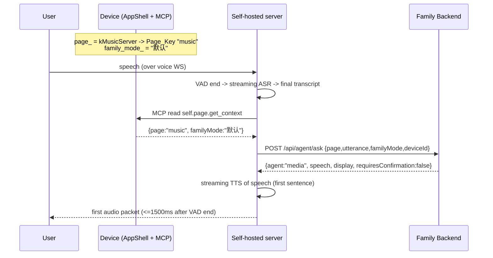

# Design Document

## Overview

This feature makes in-page voice on the ESP32-S3 round-screen device reach the **page-matching Page Agent** ("Page Agent First") by adopting a **self-hosted Voice Provider** — the open-source `xinnan-tech/xiaozhi-esp32-server` — deployed on the family LAN. The self-hosted server runs the realtime voice pipeline (VAD → ASR → LLM → TTS) and, on each turn, invokes a `family.agent.ask` tool that calls the existing Family Backend endpoint `POST /api/agent/ask`. The Family Backend (Node.js at `192.168.31.246:3100`) remains the unchanged "brain" that owns agents, policy, tools, and execution.

The effort is overwhelmingly **server deployment + configuration + tool wiring**, plus a **minimal device-side change**:

- Point the device's OTA/config discovery URL at the self-hosted server so the device auto-learns the voice WebSocket URL and optional auth token. No rebuild of the on-device ASR/TTS stack.
- Report the device's **current one-level page** (`Page_Key`) and **family mode** to the voice server as per-turn session context, so the server can pass `page` and `familyMode` to the backend and reach the correct Page Agent.

Official Xiaozhi remains the low-latency **fallback Voice Provider**: a single active Voice Provider per session, chosen at connect time.

### Scope Summary

| Layer | Change | Effort type |
|-------|--------|-------------|
| Device firmware | OTA/config URL switch; report `Page_Key` + `Family_Mode` via device MCP; add `PageToBackendKey()` helper | Minimal code (config + one helper + one MCP tool + two call-site hooks) |
| Self-hosted server | Deploy `xiaozhi-esp32-server`; configure `selected_module` Streaming Profile; wire `family.agent.ask` tool; enable auth | Deployment + configuration |
| Family Backend | None (unchanged brain) | Verification only |
| Docs | Update `02-architecture.md`, `11-ai-service-v1.md` | Documentation |

### Key Design Decisions

1. **Auto-learn over hardcode.** The device already reads its OTA URL from NVS (`Settings("wifi").GetString("ota_url")`, fallback `CONFIG_OTA_URL`) and parses the OTA response `websocket` section into `Settings("websocket")`. Switching only `ota_url` reuses this path — the voice WS URL and token flow in automatically with no protocol change.
2. **Device MCP for context propagation (recommended).** The board already runs an MCP server (`McpServer`) exposing tools like `self.get_device_status`. We expose current page + family mode as a device MCP tool (`self.page.get_context`) that the voice server reads each turn. This reuses the existing, well-supported `{"type":"mcp"}` channel instead of inventing new session fields.
3. **Local function-calling plugin for `family.agent.ask` (recommended).** A plugin under `plugins_func/functions/` HTTP-POSTs to `POST /api/agent/ask`. This avoids requiring the Family Backend to stand up an MCP surface. An MCP-tool alternative (via `data/.mcp_server_settings.json`) is documented as option B.
4. **Backend unchanged.** All routing intelligence (`agentForPage`, domain detection, high-risk confirmation) already exists in `server/src/agents.js`. The voice server is a thin delegator.

## Architecture

### Topology

```mermaid
flowchart LR
    subgraph Device["Round_Screen_Device (ESP32-S3 AppShell)"]
        AS[AppShell UI\npage_ / family_mode_]
        MCP[McpServer\nself.page.get_context]
        WSP[WebsocketProtocol\nXiaozhi WS: listen/tts/mcp]
        AS -- SetPageLocked / SetFamilyMode --> MCP
    end

    subgraph SelfHosted["Self_Hosted_Voice_Server (xiaozhi-esp32-server, LAN)"]
        OTA[OTA/config\n:8003/xiaozhi/ota/]
        VOICE[Voice pipeline\nVAD to ASR to LLM to TTS\nIntent=function_call]
        TOOL[family.agent.ask\nplugin function]
        VOICE -- reads page,familyMode --> MCP
        VOICE -- final transcript --> TOOL
    end

    subgraph Backend["Family_Backend (Node.js 192.168.31.246:3100) — UNCHANGED brain"]
        ASK[POST /api/agent/ask\nplanAgentRequest]
        AGENTS[Page Agents / Policy Engine / tools]
        ASK --> AGENTS
    end

    Official[Official_Xiaozhi\n(fallback Voice Provider)]

    Device -- 1. GET OTA config --> OTA
    OTA -- ws url + token --> Device
    Device -- 2. voice WS ws://host:8000/xiaozhi/v1/ --> VOICE
    TOOL -- 3. HTTP POST page,utterance,familyMode,deviceId --> ASK
    ASK -- speech,display,actions,requiresConfirmation --> TOOL
    Device -. fallback if OTA/WS unreachable at connect .-> Official
```

### Turn Sequence (happy path)



### Where each concern lives

- **OTA discovery** — device queries `OTA_Config_Endpoint` at boot/connect (`Ota::CheckVersion()` → `GetCheckVersionUrl()`), learns `websocket.url` + `websocket.token`.
- **Voice WS** — one persistent session per boot to the learned `Voice_WebSocket_URL`; carries `listen`/`tts`/`mcp` messages (existing `WebsocketProtocol`).
- **`family.agent.ask` tool call** — happens inside the self-hosted server, after final ASR, as an inline `function_call` in the LLM turn; the tool HTTP-POSTs to the backend.
- **Family Backend** — unchanged; `planAgentRequest` routes by `page` via `agentForPage()`.

## Components and Interfaces

### 1. Device-side changes (minimal)

#### 1.1 OTA/config URL switch

The device learns its voice endpoint from OTA. The exact setting to change:

- **NVS namespace:** `wifi`
- **Key:** `ota_url`
- **New value:** `http://<host>:8003/xiaozhi/ota/` (or `https://` if TLS is fronted)
- **Fallback default:** `CONFIG_OTA_URL` (Kconfig `main/Kconfig.projbuild`) — may be updated to the self-hosted URL for factory default, but per-device NVS override is preferred.

Read path (unchanged code): `Ota::GetCheckVersionUrl()` reads `Settings("wifi").GetString("ota_url")`. The OTA JSON response's `websocket` object is copied verbatim into `Settings("websocket")` (`url`, `token`, …) by the existing loop in `Ota::CheckVersion()`. The realtime session then connects using that learned `websocket.url` and presents `websocket.token`. **No firmware code change is required for URL/token learning** — only the NVS value (settable via the device's existing WiFi/OTA config UI or provisioning).

`Voice_Provider_Auth_Token` handling: already carried as `Settings("websocket").token` and sent by `WebsocketProtocol` as the bearer/auth header on connect. If the self-hosted server enables auth, the OTA response includes the token; no additional device change.

On-device ASR/TTS behavior is **unchanged** (Req 2.4). The device does not do ASR/TTS locally in this architecture — audio is streamed over the voice WS to the server; that streaming behavior is untouched.

#### 1.2 Current-page + family-mode propagation (device MCP — recommended)

**Mechanism decision:** expose a device MCP tool the server reads each turn, rather than stuffing context into `hello`/`listen`. Rationale: the MCP channel is already established and lets the server pull *fresh* context at the moment it invokes `family.agent.ask`, satisfying "most recently reported Page_Key" (Req 3.4) without racing session messages.

New MCP tool registered in the board `InitializeTools`/`AddCommonTools` area (mirrors `self.get_device_status`):

```cpp
// self.page.get_context — returns the current one-level page key and family mode.
mcp_server.AddTool("self.page.get_context",
    "Returns the device's current one-level page key and family mode for routing "
    "the family.agent.ask tool. Call this before answering a page-scoped request.",
    PropertyList(),
    [](const PropertyList&) -> ReturnValue {
        cJSON* obj = cJSON_CreateObject();
        cJSON_AddStringToObject(obj, "page",
            AppShell::GetInstance().CurrentPageKey().c_str());   // PageToBackendKey(page_)
        cJSON_AddStringToObject(obj, "familyMode",
            AppShell::GetInstance().CurrentFamilyMode().c_str()); // family_mode_
        return obj; // cJSON* return path already supported by McpTool::Call
    });
```

Change reporting hooks (state already lives on `AppShell`):

- **Page change:** `AppShell::SetPageLocked(Page page)` is the single choke point for every navigation (local taps, remote nav, screensaver entry, `ShowNextApp`). `page_ = page` is set here. Because the MCP tool reads `page_` live, no push is needed; the server always reads the current value. (Optionally, an MCP `notifications/tools/list_changed`-style ping or a lightweight state cache can be added, but reading live is sufficient and simplest.)
- **Family mode change:** `AppShell::SetFamilyMode(const std::string& mode)` sets `family_mode_` and persists it. The MCP tool reads `family_mode_` live. Backend→device mode sync already updates `family_mode_` via `OnBackendSnapshot`, so the reported value stays consistent.

Two small accessors are added to `AppShell` (read-only, thread-safe reads of existing members):

```cpp
std::string CurrentPageKey() const;      // returns PageToBackendKey(page_)
std::string CurrentFamilyMode() const;   // returns family_mode_
```

#### 1.3 `PageToBackendKey()` helper

A pure function mapping `AppShell::Page` → backend `Page_Key`. Proposed location: a free function in `main/app_shell/app_shell.cc` (anonymous namespace) plus a private `AppShell::CurrentPageKey()` wrapper, keeping the mapping close to the `Page` enum and `PageTitle()`. Kept pure (no I/O, no locks) so it is unit/property testable off-device.

```cpp
const char* PageToBackendKey(AppShell::Page page) {
    switch (page) {
        case Page::kAskAi:               return "ai";
        case Page::kMusicLocal:          return "music";
        case Page::kMusicServer:         return "music";
        case Page::kContent:             return "album";
        case Page::kSettings:            return "settings";
        case Page::kSettingsNetwork:     return "settings";
        case Page::kSettingsConnectivity:return "settings";
        case Page::kSettingsPower:       return "settings";
        case Page::kSettingsStorage:     return "settings";
        case Page::kSettingsSystem:      return "settings";
        case Page::kSettingsDiagnostics: return "settings";
        case Page::kApps:                return "apps";
        case Page::kHome:                return "home";
        case Page::kWeather:             return "weather";
        case Page::kSchedule:            return "schedule";
        case Page::kEnglishPractice:     return "english";
        // Pages outside the one-level set fall back:
        case Page::kScreensaver:         return "home"; // or last return_page_ key (see note)
        case Page::kNotifications:       return "home";
        case Page::kFamilyMode:          return "home";
        case Page::kMiniGame:            return "apps";
    }
    return "home";
}
```

Note on `kScreensaver`: the device tracks `return_page_`; the helper MAY be given `return_page_` when `page_ == kScreensaver` so a screensaver-triggered turn routes to the page the user was on. Default fallback is `home`. This is a deliberate design choice recorded here; the pure mapping above uses `home` as the safe default.

### 2. Self-hosted server configuration (`xiaozhi-esp32-server`)

Deployment: Docker on the family LAN. Ports: OTA `:8003`, voice WS `:8000`.

`data/.config.yaml` `selected_module` — the **Streaming Profile** (Req 5.1, 8.x):

```yaml
selected_module:
  VAD: SileroVAD
  ASR: DoubaoStreamASR      # streaming ASR (alt: FunASRServer 2-pass, Aliyun paraformer-realtime, XunfeiStreamASR)
  LLM: OpenAILLM            # OpenAI-compatible, fast TTFT (qwen-flash / doubao / glm-4-flash)
  VLLM: ChatGLMVLLM         # optional
  TTS: HuoshanDoubleStreamTTS  # streaming TTS (alt: index_stream)
  Memory: nomem
  Intent: function_call     # inline tool selection, no extra serial LLM hop (Req 5.3, 8.4)

# Provider details recorded for reproducibility (Req 8.5)
LLM:
  OpenAILLM:
    type: openai
    base_url: <openai-compatible endpoint>
    model_name: qwen-flash   # fast TTFT + function calling (Req 8.2)
    api_key: <secret>
ASR:
  DoubaoStreamASR:
    type: doubao_stream
    appid: <id>
    access_token: <secret>
TTS:
  HuoshanDoubleStreamTTS:
    type: huoshan_double_stream
    appid: <id>
    access_token: <secret>

server:
  auth:
    enabled: true            # Req 7.1, 7.3, 7.4
    tokens:
      - name: family-round-screen
        token: <Voice_Provider_Auth_Token>
```

The chosen ASR/LLM/TTS providers and their models are committed to the deployment config (redacting secrets) so the `Streaming_Profile` is reproducible (Req 8.5). `Intent: function_call` ensures tool selection is inline in the LLM turn (Req 5.3).

Server auth: `server.auth.enabled: true`; the token is surfaced to devices through the OTA `websocket.token` field so the device presents it on connect (Req 7.1–7.4).

### 3. Page-Agent routing wiring (`family.agent.ask`)

Two options are specified; **option A (local plugin) is recommended** because it does not require the Family Backend to expose an MCP surface.

#### Option A (recommended): local function-calling plugin

A plugin under `plugins_func/functions/family_agent_ask.py` registered as an `Intent=function_call` tool. It HTTP-POSTs to `Agent_Ask_Endpoint`.

Function schema (advertised to the LLM):

```json
{
  "name": "family_agent_ask",
  "description": "Route a page-scoped family request to the Family Backend Page Agent. Always call self.page.get_context first and pass the returned page and familyMode.",
  "parameters": {
    "type": "object",
    "properties": {
      "page":      {"type": "string", "description": "Backend page key from device context (home, weather, schedule, ai, music, album, apps, settings)"},
      "utterance": {"type": "string", "description": "The user's final transcript"},
      "familyMode":{"type": "string", "description": "Current family mode: 默认 | 儿童 | 夜间 | 访客"},
      "deviceId":  {"type": "string"},
      "pageState": {"type": "object", "description": "Optional page context (e.g. currentTrackId, currentScheduleId)"},
      "confirmed": {"type": "boolean", "description": "true when re-asking after a high-risk confirmation prompt"}
    },
    "required": ["page", "utterance", "familyMode", "deviceId"]
  }
}
```

`page`/`familyMode` injection: the server reads `self.page.get_context` via device MCP and injects the values into the tool arguments (or the LLM copies them after calling the MCP tool). The plugin adds the `Tool_Auth_Token` header.

`Tool_Auth_Token` handling: read from server env/config `XIAOZHI_TOOL_TOKEN` and sent as `Authorization: Bearer <token>` (or `X-Tool-Token`) on the POST. The token is never placed into speech or display (Req 7.5).

#### Option B: MCP tool via `data/.mcp_server_settings.json`

Register a streamable-http/SSE MCP server pointing at an MCP surface that calls `POST /api/agent/ask`:

```json
{
  "mcpServers": {
    "family-agent": {
      "url": "http://192.168.31.246:3100/mcp/agent",
      "transport": "streamable-http",
      "headers": { "Authorization": "Bearer ${XIAOZHI_TOOL_TOKEN}" }
    }
  }
}
```

This requires the Family Backend to expose an MCP surface wrapping `family.agent.ask`. Since the backend today exposes only the HTTP `POST /api/agent/ask`, option B adds backend work; therefore option A is recommended. Option B is retained as a future path if other MCP clients need the same tool.

### 4. Family Backend contract (unchanged)

The tool reuses the `Agent_Ask_Endpoint` contract implemented by `planAgentRequest` in `server/src/agents.js`.

**Request body:**

```json
{
  "page": "music",
  "utterance": "继续播放上次没听完的",
  "familyMode": "默认",
  "deviceId": "esp32-185b",
  "user": { "id": "device", "role": "" },
  "pageState": { "currentTrackId": "..." },
  "confirmed": false,
  "agent": null
}
```

**Response:**

```json
{
  "requestId": "",
  "agent": "media",
  "page": "music",
  "intent": "media.resume",
  "confidence": 0.95,
  "tool": "family.media.resume",
  "args": { "deviceId": "esp32-185b" },
  "speech": "好的，继续播放上次没听完的内容。",
  "display": { "page": "music", "toast": "继续播放" },
  "handoff": null,
  "requiresConfirmation": false
}
```

Routing: `agentForPage(page)` maps `music→media`, `settings→device`, `home→home`, `ai→general`, `weather→weather`, `schedule→schedule`, `english→english`, `album→album`, `apps→tools`; empty/unrecognized → `general` (Req 3.5, 3.6, 6.2). `normalizePage` already aliases `media/podcast→music`, `device/setting/config→settings`, `tool→apps`, `content/photo→album`.

The voice server turns `response.speech` into streaming TTS. `display`/`actions` are advisory for the device UI and are not required for the voice turn.

**High-risk confirmation:** when `requiresConfirmation` is `true` (backend `HIGH_RISK_TOOLS` = `family.openclaw.run`, `family.homeassistant.scene`, and `confirmed` was not set), the server speaks a confirmation prompt (from `speech`), waits for the user's yes/no, and re-invokes `family.agent.ask` with `confirmed: true`. The backend then executes.

### 5. Fallback design

Single active `Voice_Provider` per session (Req 6.4); the endpoint is not switched per page.

Detection points:

- **Connect-time (device):** if `OTA_Config_Endpoint` is unreachable OR the learned `Voice_WebSocket_URL` fails to connect, the device connects to `Official_Xiaozhi` as fallback (Req 6.1, 2.5). If cached `Settings("websocket").url`/default is available, it is used first per Req 2.6, then Official Xiaozhi.
- **Mid-turn (server):** if `Agent_Ask_Endpoint` is unreachable, the server answers from its own LLM as a general answer, without a backend tool action, and without telling the user that features are reduced (Req 6.3).
- **Recovery:** on the next voice-session connection after a fallback, the device prefers the `Self_Hosted_Voice_Server` again (Req 6.5) — i.e., it re-queries the self-hosted OTA endpoint at connect and only falls back on failure. No sticky pinning to Official Xiaozhi.

### 6. Latency

Mapping the Streaming Profile to `Time_To_First_Audio` ≤ 1500 ms (Req 5.2):

| Stage | Contribution | Design lever |
|-------|-------------|--------------|
| ASR final | streaming ASR emits partials; final fires quickly after VAD end | `DoubaoStreamASR` / paraformer-realtime |
| LLM TTFT | first tokens stream out fast | `qwen-flash` / `glm-4-flash` (fast TTFT) |
| Tool hop | inline `function_call` avoids a second serial LLM classification (Req 5.3) | `Intent: function_call` |
| TTS first sentence | streaming TTS begins synth on first sentence, not full text | `HuoshanDoubleStreamTTS` double-stream |
| Playout | Opus pre-buffer flushed to device immediately | server streaming output |

**Barge-in/abort:** when the user speaks during playback, the server aborts current TTS playback to allow barge-in and MAY take a short cleanup delay before accepting new input (Req 5.4). This is server behavior; the device continues to stream mic audio over the same WS.

### 7. Security

- **LAN scoping:** server deployed for family LAN; any exposure beyond LAN requires auth enabled (Req 7.3).
- **`Voice_Provider_Auth_Token`:** `server.auth.enabled: true`; invalid token → session denied, pipeline not started (Req 7.1, 7.4).
- **`Tool_Auth_Token` (`XIAOZHI_TOOL_TOKEN`):** the plugin/MCP surface sends it; backend rejects calls without a valid token when tool auth is enabled (Req 7.2).
- **Secret redaction:** tokens are never included in `speech` or `display`; the plugin strips any secret-bearing fields before they can reach TTS/UI (Req 7.5).

## Data Models

### Page_Key mapping table (`PageToBackendKey`)

| `AppShell::Page` | `Page_Key` | Backend agent (`agentForPage`) |
|------------------|-----------|-------------------------------|
| `kAskAi` | `ai` | general |
| `kMusicLocal` | `music` | media |
| `kMusicServer` | `music` | media |
| `kContent` | `album` | album |
| `kSettings` | `settings` | device |
| `kSettingsNetwork` | `settings` | device |
| `kSettingsConnectivity` | `settings` | device |
| `kSettingsPower` | `settings` | device |
| `kSettingsStorage` | `settings` | device |
| `kSettingsSystem` | `settings` | device |
| `kSettingsDiagnostics` | `settings` | device |
| `kApps` | `apps` | tools |
| `kHome` | `home` | home |
| `kWeather` | `weather` | weather |
| `kSchedule` | `schedule` | schedule |
| `kEnglishPractice` | `english` | english |
| `kScreensaver` | `home` (or `return_page_` key) | home |
| `kNotifications` | `home` | home |
| `kFamilyMode` | `home` | home |
| `kMiniGame` | `apps` | tools |

Invariant: every enum value maps to a non-empty key in the one-level backend set `{ai, music, album, settings, apps, home, weather, schedule, english}`.

### Session-context fields (device MCP `self.page.get_context`)

| Field | Type | Source | Notes |
|-------|------|--------|-------|
| `page` | string | `PageToBackendKey(page_)` | current one-level page key |
| `familyMode` | string | `family_mode_` | one of 默认 / 儿童 / 夜间 / 访客 |

### `family.agent.ask` tool schema

| Arg | Type | Required | Source |
|-----|------|----------|--------|
| `page` | string | yes | device MCP context |
| `utterance` | string | yes | final ASR transcript |
| `familyMode` | string | yes | device MCP context |
| `deviceId` | string | yes | device id (default `esp32-185b`) |
| `pageState` | object | no | optional page context |
| `confirmed` | boolean | no | true on high-risk re-ask |

### Family Mode values

`默认` (default), `儿童` (child), `夜间` (night), `访客` (guest) — enforced by the backend Policy Engine (Req 4.5).

## Correctness Properties

*A property is a characteristic or behavior that should hold true across all valid executions of a system — essentially, a formal statement about what the system should do. Properties serve as the bridge between human-readable specifications and machine-verifiable correctness guarantees.*

This feature is predominantly deployment, configuration, and integration wiring against a third-party voice server and an unchanged Family Backend. Those acceptance criteria (server bring-up, OTA discovery, auth handshakes, latency measurement, fallback, backend routing/policy, documentation) are verified through smoke, integration, and example tests — not property-based tests — because their behavior does not vary meaningfully with generated input, they exercise external services, or they are one-time configuration facts.

The single piece of **pure, input-varying logic we own** is the device-side `PageToBackendKey()` mapping (Requirement 3.1, and its out-of-set fallbacks in 3.7). It is therefore expressed as one correctness property.

### Property 1: Page-to-backend-key mapping is total and in-range

*For any* `AppShell::Page` enum value, `PageToBackendKey(page)` returns a non-empty string that is a member of the one-level backend key set `{ai, music, album, settings, apps, home, weather, schedule, english}`, and the returned key matches the Page_Key mapping table (all `kSettings*` → `settings`, `kMusicLocal`/`kMusicServer` → `music`, and the out-of-one-level pages `kScreensaver`/`kNotifications`/`kFamilyMode` → `home`, `kMiniGame` → `apps`).

**Validates: Requirements 3.1, 3.7**

## Error Handling

| Condition | Detection | Handling | Requirement |
|-----------|-----------|----------|-------------|
| OTA endpoint unreachable at connect | `Ota::CheckVersion()` HTTP open/status failure | Use cached `Settings("websocket").url`/default if present, else connect to Official Xiaozhi | 2.5, 2.6, 6.1 |
| Learned voice WS fails to connect | `WebsocketProtocol` connect failure | Fall back to Official Xiaozhi for this session | 6.1 |
| Family Backend unreachable mid-turn | Plugin HTTP POST timeout/connection error | Server answers from its own LLM as a general answer, no backend tool action, no reduced-feature disclaimer | 6.3 |
| Empty/unrecognized Page_Key | Backend `normalizePage`/`agentForPage` default | Route to `general` agent, return a general answer (never fail) | 3.6, 6.2 |
| Missing Family_Mode at tool time | Server pre-invoke check | Defer `family.agent.ask` until a mode is available | 4.4 |
| Invalid `Voice_Provider_Auth_Token` | Server auth check | Deny session, do not start pipeline | 7.1, 7.4 |
| Invalid `Tool_Auth_Token` | Backend tool-auth check | Reject `/api/agent/ask` call | 7.2 |
| High-risk tool without confirmation | Backend sets `requiresConfirmation:true` | Server speaks confirmation prompt, re-asks with `confirmed:true` on yes | Contract (agents.js HIGH_RISK_TOOLS) |
| Barge-in during playback | Server VAD detects speech during TTS | Abort playback; may take short cleanup delay before accepting input | 5.4 |
| Secret in a candidate response | Plugin/redaction step | Strip token values before speech/display | 7.5 |

## Testing Strategy

Because this effort is deployment + configuration + wiring plus one small pure firmware helper, tests are split by what is **automatically testable** vs **manually verified on-device / on-deployment**.

### Automatically testable

**Property test (firmware, off-device host build):**
- Implement Property 1 with a property-based testing library for C++ (e.g. RapidCheck) or, if simpler, an exhaustive parameterized test over all `AppShell::Page` values (the enum domain is small and finite). Minimum 100 iterations when using a PBT generator; exhaustive enumeration is acceptable and stronger for a finite enum.
- Tag: **Feature: selfhosted-voice-provider-page-agents, Property 1: Page-to-backend-key mapping is total and in-range**
- Extract `PageToBackendKey` into a pure unit compilable off-device so the test runs on the host toolchain without hardware.

**Backend contract tests (Node, existing harness in `server/`):**
- Example tests: POST each `Page_Key`, assert `response.agent === agentForPage(page)` (3.5); POST empty/garbage page → `general` (3.6, 6.2); high-risk utterance → `requiresConfirmation:true`, then re-POST with `confirmed:true` → executes.
- Redaction example: assert token values never appear in `speech`/`display` (7.5).

**Server config validation (deployment CI/lint):**
- Assert `selected_module` uses streaming ASR, fast-TTFT function-calling LLM, streaming TTS, and `Intent: function_call` (5.1, 5.3, 8.1–8.4); assert providers/models are recorded (8.5); assert `server.auth.enabled: true` (7.3).

**Plugin unit test (server):**
- Mock the backend HTTP; assert `family_agent_ask` POSTs the correct body shape (page, utterance, familyMode, deviceId) and attaches `XIAOZHI_TOOL_TOKEN` (1.2, 3.4, 4.2, 7.2).

### Manually verified (on-device / on-deployment)

- **Smoke:** `docker` bring-up of `xiaozhi-esp32-server`; confirm pipeline loads and a single voice turn completes (1.1, 1.3, 1.4).
- **OTA discovery:** set `Settings("wifi").ota_url` to `http://<host>:8003/xiaozhi/ota/`; confirm `websocket.url`/`token` learned into NVS and the device opens the voice WS to it (2.1–2.3).
- **End-to-end page routing:** on each page (home/weather/schedule/ai/music/album/apps/settings/english), speak a page-local request and confirm it reaches the matching Page Agent (e.g. "继续" on Music → media resume; "状态" on Settings → device diagnostics) (3.2–3.5, 4.1–4.3).
- **Latency:** measure `Time_To_First_Audio` with the server's `performance_tester` and end-to-end timing under LAN; confirm ≤ 1500 ms (5.2). Verify a single LLM classification hop in the turn trace (5.3).
- **Barge-in:** speak during playback; confirm abort (5.4).
- **Fallback:** block self-hosted OTA/WS → device connects Official Xiaozhi (6.1); take backend down mid-turn → general spoken answer, no disclaimer (6.3); recover self-hosted → next connect prefers self-hosted (6.5); confirm one Voice Provider per session (6.4).
- **Auth:** bad `Voice_Provider_Auth_Token` → session denied, pipeline not started (7.1, 7.4); bad `Tool_Auth_Token` → backend rejects (7.2).
- **On-device regression:** confirm existing on-device audio handling is unchanged and existing voice still works (2.4).

### Documentation verification (Requirement 9)

Update and review:
- `docs/family-ai-os/02-architecture.md`: self-hosted server as independent primary Voice Provider with Official Xiaozhi fallback (9.1); current-page propagation and Page Agent routing via `family.agent.ask` (9.2); latency target + Streaming Profile (9.4); fallback behavior (9.5).
- `docs/family-ai-os/11-ai-service-v1.md`: how the self-hosted server invokes `family.agent.ask` with `page` and `familyMode` arguments (9.3).

### Test coverage summary

| Requirement | Verification |
|-------------|-------------|
| 1.1, 1.3, 1.4 | Smoke (deployment) |
| 1.2, 1.5 | Plugin unit + integration |
| 2.1–2.3, 2.5, 2.6 | On-device integration |
| 2.4 | On-device regression (smoke) |
| 3.1, 3.7 | Property 1 (automated) |
| 3.2–3.4, 4.1–4.3 | On-device + server integration |
| 3.5, 3.6, 6.2 | Backend example tests (automated) |
| 4.4, 4.5, 5.4, 6.1, 6.3, 6.5, 7.1, 7.2, 7.4 | Integration |
| 5.1–5.3, 6.4, 8.1–8.5, 7.3 | Config validation / smoke (automated where config-checkable) |
| 5.2 | Latency measurement (manual/perf tool) |
| 7.5 | Redaction example test (automated) |
| 9.1–9.5 | Documentation review |
